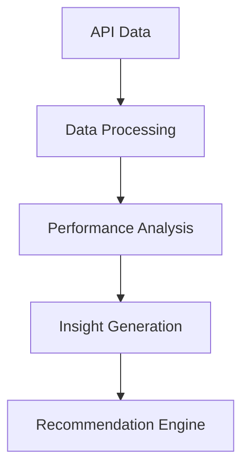

Here's a professional README template tailored to your project:

---

# NEET Performance Analyzer  
*Personalized Quiz Insights & Recommendation System*


## 🚀 Setup Instructions

### Prerequisites
- Python 3.8+
- Google Gemini API key


## 📌 Project Overview
**Objective:** AI-powered analysis system for NEET aspirants' quiz performance  
**Key Features:**
- Historical performance tracking (Last 5 quizzes)
- Weak/Strong topic identification
- Gemini-powered personalized recommendations
- Time management insights
- Progress visualization

**Data Sources:**
- `HISTORICAL_API_ENDPOINT`: Past quiz performance
- `SUBMISSION_API_ENDPOINT`: Current quiz analysis

## 🔍 Analytical Approach

### Architecture



### Key Components
1. **Data Pipeline**
   - Automated API ingestion
   - Duration normalization
   - Response accuracy mapping

2. **Core Analysis**
   ```python
   def analyze_performance():
       # Topic-level aggregation
       # Difficulty pattern detection
       # Time/accuracy correlation
   ```

3. **Recommendation Engine**
   - Weakness prioritization
   - Adaptive learning strategies
   - Gemini-generated study plans


## 📊 Sample Insights & Visualizations


### Terminal Output Preview


### Key Metrics Dashboard


### Recommendation Sample
```text
🔥 Priority Areas:
1. Organic Chemistry - Basic Principles (Accuracy: 38%)
2. Human Physiology - Digestion (Avg. Time: 2.4min/question)

💡 Suggested Actions:
- Daily 15min focused practice on IUPAC nomenclature
- Attempt 3 previous year questions on enzyme mechanisms
```
## 📈 Insights Summary
🏆 Best Performing Topic: human health and disease
   Average Score: 112.00
   Attempts: 1
  
### Performance Patterns
OUTPUT:::>>
________________________________________________________________________________________________________
📋 Topic Performance Summary:
______Weak Topics______

📊 Topic: Body Fluids and Circulation 
   🔢 Attempts: 3
   🎯 Average Score: 54.67

📊 Topic: Human Reproduction
   🔢 Attempts: 1
   🎯 Average Score: 40.00

📊 Topic: Reproductive Health
   🔢 Attempts: 1
   🎯 Average Score: 52.00

📊 Topic: Respiration and Gas Exchange
   🔢 Attempts: 1
   🎯 Average Score: 24.00

📊 Topic: principles of inheritance and variation
   🔢 Attempts: 1
   🎯 Average Score: 12.00

📊 Topic: reproductive health
   🔢 Attempts: 2
   🎯 Average Score: 52.00

______Strong Topics______

📊 Topic: Body Fluids and Circulation
   🔢 Attempts: 3
   🎯 Average Score: 86.67

📊 Topic: human health and disease
   🔢 Attempts: 1
   🎯 Average Score: 112.00

📊 Topic: microbes in human welfare
   🔢 Attempts: 1
   🎯 Average Score: 76.00
_________________________________________________________________________________


